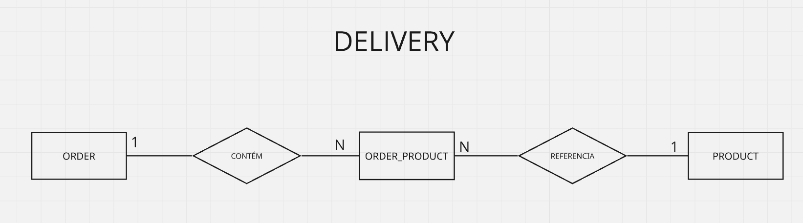

  <h1>
    Nanoprojeto: JDBC
  </h1>

---

  
    
  

---

  
    
  

    
  
  
    
  

---

# 📋 Resumo

Este nanoprojeto foi desenvolvido com um objetivo educacional específico: **praticar o acesso direto a um banco de dados relacional utilizando JDBC, sem a utilização de frameworks de persistência**.
Utilizando como domínio uma aplicação simples de delivery, o que permite com poucas entidades praticar operações simples e complexas de acesso e manipulação de dados.
O foco está em compreender o que precisa ser realizado manualmente pelo desenvolvedor.

---

> **⚠️ Nota sobre este nanoprojeto**
>
> Este projeto possui caráter exclusivamente educacional e possui um objetivo específico: **praticar o acesso direto a um banco de dados relacional utilizando JDBC, sem a utilização de frameworks de persistência**.
>
> Utilizando como domínio uma aplicação simples de delivery, o projeto percorre operações CRUD, além de explorar relacionamentos entre entidades, transações, paginação, concorrência e operações em lote.
>
> O foco está em compreender o que precisa ser realizado manualmente quando o acesso ao banco é feito através do JDBC, incluindo transformação dos dados para objetos Java, gerenciamento de transações e tratamento de concorrência.
>
> Em outras palavras: **o objetivo aqui não é construir  o projeto perfeito, seguro e altamente estruturado, mas compreender profundamente os fundamentos que sustentam ORMs e Frameworks do ecossistema ao redor do Java antes de evoluir para recursos mais avançados, trazendo entendimento profundo de seu funcionamento e diagnóstico quando houver quebras.**

---

# Modelo de dados

Visualização(simplificada) do modelo de dados utilizado.

---

# Algumas perguntas que este nanoprojeto busca responder

- O que preciso fazer manualmente quando acesso um banco relacional diretamente através do JDBC?
- Como uma consulta SQL é transformada em um objeto Java?
- Como o JDBC trabalha com parâmetros em uma query?
- Como tratar valores nulos retornados pelo banco?
- Como recuperar chaves geradas pelo banco após um `INSERT`?
- Quando preciso controlar explicitamente uma transação?
- O que acontece quando uma operação envolve várias instruções SQL?
- Como representar manualmente um relacionamento entre entidades?
- Como o JDBC trata carregamento de dados relacionados?
- Como controlar concorrência utilizando JDBC?
- Como executar operações em lote utilizando JDBC?

---

# Conceitos Praticados

## Conexão com o Banco

- JDBC
- PostgreSQL
- `DriverManager`
- `Connection`
- Connection Factory
- Configuração através de variáveis de ambiente
- Gerenciamento de conexão
- Singleton de conexão
- N conexões abertas operando de forma concorrente

## CRUD

### Consulta

- entidade única
- entidades associadas
- consulta individual e listagem
- carregamento eager e lazy
- paginação.

### Inserção

- inserção de unidade
- inserção em lote
- inserção de entidades associadas

### Atualização

- atualização simples de registro
- atualização concorrente

### Deleção

- deleção de registros
- Integridade referencial
- Deleção de relacionamento N:N

---

## Menu de testes

Foi criado um menu de terminal para facilitar a execução das operações implementadas.
O objetivo do menu não é representar uma interface de usuário final, mas permitir executar rapidamente cada experimento e observar seus resultados.
As operações podem ser executadas individualmente para facilitar a comparação dos comportamentos do JDBC.

#### CRUD

- Find All Product
- Find All Order
- Find By ID Product
- Find By ID Order
- Find Orders With Products
- Find Order With Products
- Insert Product
- Insert Order
- Insert Order With Products
- Update Product
- Update Order
- Delete Product
- Delete Order
- Delete Order/Product Relationship

#### Operações extras

- Paginação
- Concorrência
- Operação em lote (Batch)

# Relacionamento entre entidades

O projeto possui 3 entidades:

- Order
- Product
- order_product

O projeto utiliza uma relação N:N entre `Order` e `Product`.
A relação é representada pela tabela intermediária tb_order_product

## O que a prática deivou evidente:

### Parsing manual

Uma das características mais importantes observadas durante o projeto foi a necessidade de realizar o mapeamento manualmente.

Isso exige atenção aos:

- nomes das colunas;
- tipos retornados pelo banco;
- tipos utilizados pelo Java;
- valores NULL;
- projeção da consulta;
- composição de objetos relacionados.

### PreparedStatement

O projeto utiliza `PreparedStatement` para execução das consultas parametrizadas.
Foi possível observar que o JDBC utiliza parâmetros posicionais (?).
Parâmetros nomeados não fazem parte do JDBC puro e são disponibilizados por abstrações posteriores, como `Hibernate` ou `NamedParameterJdbcTemplate`.
As abstrações como `Hibernate`(abordado em outro projeto) são implementações da especificação JPA que o ecossistema Java determina como meio para acesso e manipulação a dados.
O `PreparedStatement` também permite que os parâmetros sejam tratados como dados, evitando a concatenação direta de valores na SQL.

## Transações

Nos comandos simples, o JDBC utiliza autoCommit por padrão.

Dessa forma, operações isoladas de `INSERT`, `UPDATE` e `DELETE` podem ser confirmadas automaticamente.
Quando uma operação envolve **múltiplas instruções** que precisam ser tratadas como uma única unidade, **foi necessário controlar explicitamente a transação**.
Um dos experimentos foi a criação de uma Order e posteriormente a criação dos relacionamentos entre a Order e seus Products.
Nesse caso, o commit somente deve ocorrer depois que todas as operações necessárias forem concluídas.

### Paginação

Foi implementada paginação utilizando `LIMIT` e `OFFSET`.

- O deslocamento é calculado a partir da página e do tamanho solicitado.
- A paginação foi implementada diretamente na consulta SQL, sem depender de estado armazenado na aplicação.
- Na implementação aplicada basta a aplicação informar ao banco a página e seu comprimento(size) para obter os registros desejados.

### Concorrência

Para estudar concorrência, o projeto implementa duas formas de validação do estado do registro antes da atualização(Lock Otimista).

**Estratégia 1 — id + price**

- A atualização utiliza o valor anteriormente observado
- Dessa forma, a alteração somente ocorre se o preço ainda possuir o valor que foi observado anteriormente.
- O problema dessa abordagem é o uso um dado de negócio para validação, algo que pode mudar durante a implementação/manutenção e uso da aplicação.
- A validação possui aspecto não funcional, portanto não é o ideal ser feito desta forma.

**Estratégia 2 — id + version**

- Foi adicionada uma coluna de controle de versão.
- A atualização utiliza a versão observada
- O incremento da versão é realizado pelo próprio banco.
- O objeto Java mantém a versão que foi observada durante a leitura e não precisa incrementá-la manualmente.
- Desta forma não é preciso duplicar o controle e manipulação de um atributo de negócio para validação.
- `version` em um contexto real não fica sob responsabilidade da aplicação/desenvolvedor de forma tão manual, tão pouco visível ao usuário.

**Threads e sincronização**

Para simular dois usuários concorrendo pela atualização de um mesmo registro, foram utilizadas duas threads e duas conexões independentes.
A sincronização foi realizada utilizando `CountDownLatch` e `await()`.

O experimento foi controlado para que:

- As duas threads consultassem o registro.
- Ambas obtivessem o mesmo estado inicial.
- A Thread A realizasse a atualização.
- A Thread A confirmasse a transação.
- A Thread B tentasse atualizar utilizando o estado anteriormente observado.
- O banco identificasse que o estado utilizado pela Thread B estava obsoleto.

Esse experimento permitiu observar na prática o funcionamento do **controle otimista** de concorrência.

### Batch

Também foi implementada uma operação em lote utilizando `PreparedStatement`.

- Em vez de executar cada `INSERT` individualmente, os parâmetros são adicionados ao `batch`.
- Depois, todas as operações são executadas.
- O resultado contém o status de cada operação realizada.
- O experimento também utiliza uma transação explícita com `AutoCommit` desabilitado, permitindo que o conjunto da operação seja confirmado ou revertido.

# Conclusão

Este nanoprojeto foi desenvolvido como um laboratório prático para compreender o JDBC de forma direta.
A implementação mostrou que, ao trabalhar diretamente com JDBC, uma parcela significativa do comportamento normalmente abstraído por frameworks precisa ser construída e controlada manualmente.
O resultado não pretende representar uma aplicação pronta para produção.
O objetivo foi compreender os fundamentos.

## Tecnologias utilizadas

- Java 21
- JDBC
- PostgreSQL 16
- PostgreSQL JDBC Driver 42.7.4
- Maven
- Docker
- Docker Compose
- SQL
- Git
- Make
- Linux

## Principais aprendizados

Este projeto mostrou algumas responsabilidades que ficam ocultas quando são utilizadas abstrações de persistência.

Entre elas:

- abertura e gerenciamento de conexões;
- construção de SQL;
- definição dos parâmetros;
- execução de comandos;
- leitura do ResultSet;
- transformação manual dos dados em objetos;
- tratamento de valores nulos;
- recuperação de chaves geradas;
- controle de transações;
- commit;
- rollback;
- controle de autoCommit;
- gerenciamento de relacionamentos;
- carregamento manual de entidades relacionadas;
- paginação;
- concorrência;
- controle otimista de versão;
- execução em lote.

Essas responsabilidades ajudam a compreender por que ferramentas de persistência como `Hibernate` surgiram como uma camada de abstração sobre esse tipo de código.
Também foi possível observar o tempo dedicado e risco de ter o desenvolvedor lidando manualmente com cada aspecto da conexão, acesso e manipulação da camada de dados de forma manual, onde em cenário real pode-se fazer uso de outras ferramentas(já citado anteriormente) e sendo direcionado a criação de funcionalidades do negócio/produto a ser desenvolvido.

## Próximos Passos / Melhorias

Este repositório permanecerá disponível para novos experimentos relacionados a JDBC.

**Possíveis evoluções:**

- Pool de conexões
- DataSource
- Try-with-resources
- Tratamento de exceções mais elaborado
- Transações envolvendo múltiplos DAOs
- Isolamento de transações
- Deadlocks
- Lock pessimista
- SELECT ... FOR UPDATE
- Stored Procedures
- Functions
- Views
- CTE
- Window Functions
- Otimização de consultas
- Planos de execução

## Referências

Alguns dos materiais utilizados como apoio durante o desenvolvimento e os experimentos deste nanoprojeto:

- **Oracle Java Documentation** — `PreparedStatement` e fundamentos de JDBC.
- **GeeksforGeeks** — JDBC, `ResultSet`, Threads, `CountDownLatch` e Batch.
- **Baeldung** — paginação e processamento em lote com JDBC.
- **DevMedia** — JDBC, Threads e conceitos de Lazy/Eager Loading.
- **ByteByteGo** — conceitos de Optimistic e Pessimistic Locking.
- **Neon** — conexão Java/PostgreSQL e transações.
- **DevSuperior** — projeto de referência utilizado durante os estudos de JDBC com PostgreSQL.
- **Stack Overflow** — consultas pontuais sobre utilização de `Optional` e JDBC.
