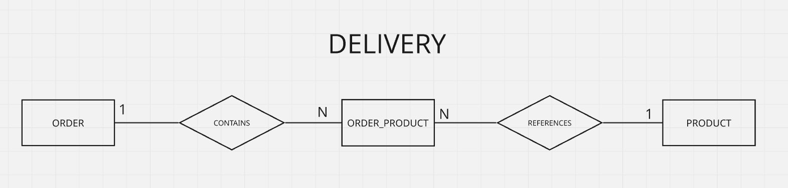

  <h1>
    Nanoproject: JDBC
  </h1>

---

  
    
  

---

  
    
  

    
  
  
    
  

---

# 📋 Summary

This nano-project was developed with a specific educational objective: **to practice direct access to a relational database using JDBC, without relying on persistence frameworks**.
It uses a simple delivery application as its domain, allowing for the practice of both simple and complex data access and manipulation operations with just a few entities.
The focus is on understanding the tasks that must be performed manually by the developer.

---

> **⚠️ Note on this nanoproject**
>
> This project is exclusively educational in nature and has a specific objective: **to practice direct access to a relational database using JDBC, without the use of persistence frameworks**.
>
> Using a simple food delivery application as the domain, the project covers CRUD operations while also exploring entity relationships, transactions, pagination, concurrency, and batch operations.
>
> The focus is on understanding what needs to be handled manually when accessing the database via JDBC, including data transformation into Java objects, transaction management, and concurrency handling.
>
> In other words: **the goal here is not to build a perfect, secure, and highly structured project, but to gain a deep understanding of the fundamentals underpinning the ORMs and frameworks in the Java ecosystem before moving on to more advanced features—thereby ensuring a thorough grasp of how they work and how to diagnose issues when things break.**

---

# Data model

(Simplified) visualization of the data model used.

---

# Some questions this nano-project seeks to answer

- What do I need to do manually when accessing a relational database directly via JDBC?
- How is an SQL query transformed into a Java object?
- How does JDBC handle query parameters?
- How do I handle null values ​​returned by the database?
- How do I retrieve database-generated keys after an `INSERT`?
- When do I need to explicitly manage a transaction?
- What happens when an operation involves multiple SQL statements?
- How do I manually represent a relationship between entities?
- How does JDBC handle the loading of related data?
- How do I manage concurrency using JDBC?
- How do I execute batch operations using JDBC?

---

# Concepts Put into Practice

## Database Connection

- JDBC
- PostgreSQL
- `DriverManager`
- `Connection`
- Connection Factory
- Configuration via environment variables
- Connection management
- Connection Singleton
- N open connections operating concurrently

## CRUD

### Read

- single entity
- associated entities
- individual lookup and listing
- eager and lazy loading
- pagination.

### Create

- single-unit insertion
- batch insertion
- insertion of associated entities

### Update

- simple record update
- concurrent update

### Delete

- record deletion
- Referential integrity
- Deletion of N:N relationship

---

## Test menu

A terminal menu was created to facilitate the execution of the implemented operations.
The menu is not intended to serve as an end-user interface, but rather to allow for the quick execution of each experiment and the observation of its results.
The operations can be executed individually to facilitate the comparison of JDBC behaviors.

#### CRUD

- Find All Product
- Find All Order
- Find By ID Product
- Find By ID Order
- Find Orders With Products
- Find Order With Products
- Insert Product
- Insert Order
- Insert Order With Products
- Update Product
- Update Order
- Delete Product
- Delete Order
- Delete Order/Product Relationship

#### Additional operations

- Pagination
- Concurrency
- Batch operation

# Relationship between entities

The project has three entities:

- Order
- Product
- order_product

The project uses a many-to-many (N:N) relationship between `Order` and `Product`.
The relationship is represented by the intermediate table `tb_order_product`.

## What practice made evident:

### Manual parsing

One of the most important characteristics observed during the project was the need to perform the mapping manually.

This requires attention to:

- column names;
- types returned by the database;
- types used by Java;
- NULL values;
- the query projection;
- the composition of related objects.

### PreparedStatement

The project uses `PreparedStatement` to execute parameterized queries.
It was observed that JDBC uses positional parameters (?).
Named parameters are not part of standard JDBC and are provided by higher-level abstractions, such as `Hibernate` or `NamedParameterJdbcTemplate`.
Abstractions like `Hibernate` (covered in another project) are implementations of the JPA specification, which the Java ecosystem establishes as the standard for data access and manipulation.
`PreparedStatement` also allows parameters to be treated as data, avoiding the direct concatenation of values ​​into the SQL string.

## Transactions

For simple commands, JDBC uses auto-commit by default.

In this way, isolated `INSERT`, `UPDATE`, and `DELETE` operations can be automatically committed.
When an operation involves **multiple statements** that must be treated as a single unit, **it was necessary to explicitly control the transaction**.
One of the experiments involved creating an Order and subsequently establishing the relationships between the Order and its Products.
In this case, the commit should only occur after all necessary operations have been completed.

### Pagination

Pagination was implemented using `LIMIT` and `OFFSET`.

- The offset is calculated based on the requested page and size.
- Pagination was implemented directly within the SQL query, without relying on application-stored state.
- With this implementation, the application simply needs to provide the page and size to the database to retrieve the desired records.

### Competition

To study concurrency, the project implements two forms of record state validation prior to the update (Optimistic Locking).

**Strategy 1 — id + price**

- The update uses the previously observed value.
- Thus, the change occurs only if the price still holds the value that was previously observed.
- The problem with this approach is the use of business data for validation—something that may change during the application's implementation, maintenance, or usage.
- Validation is a non-functional concern; therefore, implementing it this way is not ideal.

**Strategy 2 — id + version**

- A version control column has been added.
- The update uses the observed version.
- The database itself handles the version increment.
- The Java object retains the version observed during the read operation and does not need to increment it manually.
- This eliminates the need to duplicate the logic for managing and handling a business attribute for validation purposes.
- In a real-world scenario, the `version` is not managed manually by the application or developer, nor is it visible to the user.

**Threads and synchronization**

To simulate two users competing to update the same record, two threads and two independent connections were used.
Synchronization was achieved using `CountDownLatch` and `await()`.

The experiment was controlled so that:

- Both threads queried the record.
- Both obtained the same initial state.
- Thread A performed the update.
- Thread A committed the transaction.
- Thread B attempted to update using the previously observed state.
- The database identified that the state used by Thread B was stale.

This experiment allowed for the practical observation of how **optimistic concurrency control** works.

### Batch

A batch operation using `PreparedStatement` was also implemented.

- Instead of executing each `INSERT` individually, parameters are added to the batch.
- Then, all operations are executed.
- The result contains the status of each operation performed.
- The experiment also uses an explicit transaction with `AutoCommit` disabled, allowing the entire operation set to be committed or rolled back.

# Conclusion

This nano-project was developed as a hands-on lab to gain a direct understanding of JDBC.
The implementation demonstrated that, when working directly with JDBC, a significant portion of the behavior normally abstracted by frameworks must be built and managed manually.
The result is not intended to represent a production-ready application.
The goal was to understand the fundamentals.

## Technologies used

- Java 21
- JDBC
- PostgreSQL 16
- PostgreSQL JDBC Driver 42.7.4
- Maven
- Docker
- Docker Compose
- SQL
- Git
- Make
- Linux

## Main Learnings

This project highlighted certain responsibilities that remain hidden when using persistence abstractions.

These include:

- opening and managing connections;
- constructing SQL;
- defining parameters;
- executing commands;
- reading the `ResultSet`;
- manually transforming data into objects;
- handling null values;
- retrieving generated keys;
- transaction control;
- commit;
- rollback;
- `autoCommit` control;
- managing relationships;
- manually loading related entities;
- pagination;
- concurrency;
- optimistic version control;
- batch execution.

These responsibilities help explain why persistence tools like `Hibernate` emerged as an abstraction layer over this type of code.
It also became evident how much time and risk is involved when a developer manually handles every aspect of connection, access, and data layer manipulation—whereas, in a real-world scenario, one could utilize other tools (as previously mentioned) and focus instead on building the business features or the product itself.

## Next Steps / Improvements

This repository will remain available for new experiments related to JDBC.

**Potential future developments:**

- Connection pooling
- DataSource
- Try-with-resources
- More elaborate exception handling
- Transactions involving multiple DAOs
- Transaction isolation
- Deadlocks
- Pessimistic locking
- SELECT ... FOR UPDATE
- Stored procedures
- Functions
- Views
- CTEs
- Window functions
- Query optimization
- Execution plans

## References

Some of the materials used as resources during the development and experimentation phases of this nano-project:

- **Oracle Java Documentation** — `PreparedStatement` and JDBC fundamentals.
- **GeeksforGeeks** — JDBC, `ResultSet`, Threads, `CountDownLatch`, and Batch processing.
- **Baeldung** — pagination and batch processing with JDBC.
- **DevMedia** — JDBC, Threads, and Lazy/Eager Loading concepts.
- **ByteByteGo** — Optimistic and Pessimistic Locking concepts.
- **Neon** — Java/PostgreSQL connectivity and transactions.
- **DevSuperior** — reference project used during JDBC and PostgreSQL studies.
- **Stack Overflow** — specific queries regarding the use of `Optional` and JDBC.