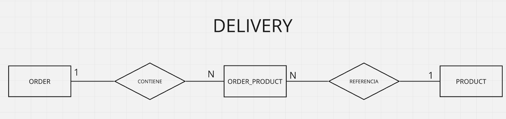

  <h1>
    Nanoproyecto: JDBC
  </h1>

---

  
    
  

---

  
    
  

    
  
  
    
  

---

# 📋 Resumen

Este nanoproyecto se desarrolló con un objetivo educativo específico: **practicar el acceso directo a una base de datos relacional utilizando JDBC, sin emplear frameworks de persistencia**.
Se utiliza como dominio una aplicación sencilla de reparto a domicilio, lo que permite practicar operaciones —tanto simples como complejas— de acceso y manipulación de datos con pocas entidades.
El enfoque reside en comprender qué tareas debe realizar manualmente el desarrollador.

---

> **⚠️ Nota sobre este nanoproyecto**
>
> Este proyecto tiene un carácter exclusivamente educativo y un objetivo específico: **practicar el acceso directo a una base de datos relacional utilizando JDBC, sin emplear frameworks de persistencia**.
>
> Utilizando como dominio una aplicación sencilla de reparto a domicilio, el proyecto recorre operaciones CRUD, además de explorar relaciones entre entidades, transacciones, paginación, concurrencia y operaciones por lotes.
>
> El enfoque está en comprender qué debe realizarse manualmente cuando el acceso a la base de datos se efectúa mediante JDBC, incluyendo la transformación de datos a objetos Java, la gestión de transacciones y el manejo de la concurrencia.
>
> En otras palabras: **el objetivo aquí no es construir el proyecto perfecto, seguro y altamente estructurado, sino comprender profundamente los fundamentos que sustentan los ORM y frameworks del ecosistema Java antes de avanzar hacia recursos más avanzados, logrando así una comprensión profunda de su funcionamiento y capacidad de diagnóstico ante posibles fallos.**

---

# Modelo de datos

Visualización (simplificada) del modelo de datos utilizado.

---

# Algunas preguntas que este nanoproyecto busca responder

- ¿Qué debo hacer manualmente al acceder a una base de datos relacional directamente a través de JDBC?
- ¿Cómo se transforma una consulta SQL en un objeto Java?
- ¿Cómo gestiona JDBC los parámetros en una consulta?
- ¿Cómo manejar los valores nulos devueltos por la base de datos?
- ¿Cómo recuperar las claves generadas por la base de datos tras un `INSERT`?
- ¿Cuándo es necesario controlar explícitamente una transacción?
- ¿Qué sucede cuando una operación implica varias instrucciones SQL?
- ¿Cómo representar manualmente una relación entre entidades?
- ¿Cómo gestiona JDBC la carga de datos relacionados?
- ¿Cómo controlar la concurrencia utilizando JDBC?
- ¿Cómo ejecutar operaciones por lotes utilizando JDBC?

---

# Conceptos aplicados

## Conexión con la base de datos

- JDBC
- PostgreSQL
- `DriverManager`
- `Connection`
- Connection Factory
- Configuración mediante variables de entorno
- Gestión de conexiones
- Singleton de conexión
- N conexiones abiertas operando de forma concurrente

## CRUD

### Consulta

- Entidad única
- Entidades asociadas
- Consulta individual y listado
- Carga *eager* y *lazy*
- Paginación

### Inserción

- Inserción de una unidad
- Inserción por lotes
- Inserción de entidades asociadas

### Actualización

- Actualización simple de registro
- Actualización concurrente

### Eliminación

- Eliminación de registros
- Integridad referencial
- Eliminación de relación N:N

---

## Menú de pruebas

Se ha creado un menú de terminal para facilitar la ejecución de las operaciones implementadas.
El objetivo del menú no es representar una interfaz de usuario final, sino permitir ejecutar rápidamente cada experimento y observar sus resultados.
Las operaciones pueden ejecutarse individualmente para facilitar la comparación de los comportamientos de JDBC.

#### CRUD

- Buscar todos los productos
- Buscar todos los pedidos
- Buscar producto por ID
- Buscar pedido por ID
- Buscar pedidos con productos
- Buscar pedido con productos
- Insertar producto
- Insertar pedido
- Insertar pedido con productos
- Actualizar producto
- Actualizar pedido
- Eliminar producto
- Eliminar pedido
- Eliminar relación pedido/producto

#### Operaciones adicionales

- Paginación
- Concurrencia
- Operación por lotes (Batch)

# Relación entre entidades

El proyecto cuenta con 3 entidades:

- Order
- Product
- order_product

El proyecto utiliza una relación N:N entre `Order` y `Product`.
La relación está representada por la tabla intermedia tb_order_product.

## Lo que la práctica puso de manifiesto:

### Parsing manual

Una de las características más importantes observadas durante el proyecto fue la necesidad de realizar el mapeo manualmente.

Esto exige prestar atención a:

- los nombres de las columnas;
- los tipos devueltos por la base de datos;
- los tipos utilizados por Java;
- los valores NULL;
- la proyección de la consulta;
- la composición de objetos relacionados.

### PreparedStatement

El proyecto utiliza `PreparedStatement` para la ejecución de consultas parametrizadas.
Se pudo observar que JDBC utiliza parámetros posicionales (?).
Los parámetros con nombre no forman parte de JDBC puro, sino que son proporcionados por abstracciones posteriores, como `Hibernate` o `NamedParameterJdbcTemplate`.
Las abstracciones como `Hibernate` (tratado en otro proyecto) son implementaciones de la especificación JPA, la cual el ecosistema Java establece como medio para el acceso y la manipulación de datos.
`PreparedStatement` también permite tratar los parámetros como datos, evitando la concatenación directa de valores en la sentencia SQL.

## Transacciones

En los comandos simples, JDBC utiliza *autoCommit* por defecto.

De este modo, las operaciones aisladas de `INSERT`, `UPDATE` y `DELETE` pueden confirmarse automáticamente.
Cuando una operación implica **múltiples instrucciones** que deben tratarse como una única unidad, **fue necesario controlar explícitamente la transacción**.
Uno de los experimentos consistió en crear una `Order` (pedido) y, posteriormente, establecer las relaciones entre dicha `Order` y sus `Products` (productos).
En este caso, la confirmación (*commit*) solo debe realizarse una vez que se hayan completado todas las operaciones necesarias.

### Paginación

Se implementó la paginación utilizando `LIMIT` y `OFFSET`.

- El desplazamiento (*offset*) se calcula a partir de la página y el tamaño solicitados.
- La paginación se implementó directamente en la consulta SQL, sin depender de estados almacenados en la aplicación.
- En la implementación realizada, basta con que la aplicación indique a la base de datos la página y su tamaño (*size*) para obtener los registros deseados.

### Concurrencia

Para estudiar la concurrencia, el proyecto implementa dos formas de validar el estado del registro antes de la actualización (bloqueo optimista).

**Estrategia 1 — id + price**

- La actualización utiliza el valor observado previamente.
- De esta forma, el cambio solo se produce si el precio mantiene el valor que se observó anteriormente.
- El problema de este enfoque es el uso de un dato de negocio para la validación, algo que puede cambiar durante la implementación, el mantenimiento o el uso de la aplicación.
- La validación tiene un carácter no funcional, por lo que no es ideal realizarla de esta manera.

**Estrategia 2 — id + version**

- Se añadió una columna de control de versión.
- La actualización utiliza la versión observada.
- El incremento de la versión lo realiza la propia base de datos.
- El objeto Java conserva la versión observada durante la lectura y no necesita incrementarla manualmente.
- De este modo, no es necesario duplicar el control y la manipulación de un atributo de negocio para la validación.
- En un contexto real, la gestión de `version` no recae de forma tan manual sobre la aplicación o el desarrollador, ni es visible para el usuario.

**Hilos y sincronización**

Para simular a dos usuarios compitiendo por actualizar el mismo registro, se utilizaron dos hilos y dos conexiones independientes.
La sincronización se llevó a cabo utilizando `CountDownLatch` y `await()`.

El experimento se controló para que:

- Ambos hilos consultaran el registro.
- Ambos obtuvieran el mismo estado inicial.
- El Hilo A realizara la actualización.
- El Hilo A confirmara la transacción.
- El Hilo B intentara actualizar utilizando el estado observado previamente.
- La base de datos identificara que el estado utilizado por el Hilo B estaba obsoleto.

Este experimento permitió observar en la práctica el funcionamiento del **control optimista** de concurrencia.

### Batch

También se implementó una operación por lotes (*batch*) utilizando `PreparedStatement`.

- En lugar de ejecutar cada `INSERT` individualmente, los parámetros se añaden al lote.
- Posteriormente, se ejecutan todas las operaciones.
- El resultado contiene el estado de cada operación realizada.
- El experimento también utiliza una transacción explícita con `AutoCommit` deshabilitado, lo que permite confirmar o revertir el conjunto de la operación.

# Conclusión

Este nanoproyecto se desarrolló como un laboratorio práctico para comprender JDBC de forma directa.
La implementación demostró que, al trabajar directamente con JDBC, una parte significativa del comportamiento habitualmente abstraído por los *frameworks* debe construirse y controlarse manualmente.
El resultado no pretende representar una aplicación lista para producción.
El objetivo fue comprender los fundamentos.

## Tecnologías utilizadas

- Java 21
- JDBC
- PostgreSQL 16
- PostgreSQL JDBC Driver 42.7.4
- Maven
- Docker
- Docker Compose
- SQL
- Git
- Make
- Linux

## Principales aprendizajes

Este proyecto puso de manifiesto algunas responsabilidades que permanecen ocultas cuando se utilizan abstracciones de persistencia.

Entre ellas:

- apertura y gestión de conexiones;
- construcción de SQL;
- definición de parámetros;
- ejecución de comandos;
- lectura del `ResultSet`;
- transformación manual de datos en objetos;
- tratamiento de valores nulos;
- recuperación de claves generadas;
- control de transacciones;
- *commit*;
- *rollback*;
- control de *autoCommit*;
- gestión de relaciones;
- carga manual de entidades relacionadas;
- paginación;
- concurrencia;
- control optimista de versiones;
- ejecución por lotes.

Estos aspectos ayudan a comprender por qué surgieron herramientas de persistencia como `Hibernate` para actuar como una capa de abstracción sobre este tipo de código.
También permitió apreciar el tiempo y el riesgo que implica que el desarrollador gestione manualmente cada aspecto de la conexión, el acceso y la manipulación de la capa de datos; en un escenario real, es posible utilizar otras herramientas (como las ya mencionadas) y centrarse en la creación de las funcionalidades del negocio o producto que se está desarrollando.

## Próximos pasos / Mejoras

Este repositorio permanecerá disponible para nuevos experimentos relacionados con JDBC.

**Posibles evoluciones:**

- Pool de conexiones
- DataSource
- Try-with-resources
- Gestión de excepciones más elaborada
- Transacciones que involucran múltiples DAOs
- Aislamiento de transacciones
- Deadlocks
- Bloqueo pesimista
- SELECT ... FOR UPDATE
- Procedimientos almacenados (Stored Procedures)
- Funciones
- Vistas (Views)
- CTE
- Funciones de ventana (Window Functions)
- Optimización de consultas
- Planes de ejecución

## Referencias

Algunos de los materiales utilizados como apoyo durante el desarrollo y los experimentos de este nanoproyecto:

- **Oracle Java Documentation** — `PreparedStatement` y fundamentos de JDBC.
- **GeeksforGeeks** — JDBC, `ResultSet`, hilos (Threads), `CountDownLatch` y procesamiento por lotes (Batch).
- **Baeldung** — paginación y procesamiento por lotes con JDBC.
- **DevMedia** — JDBC, hilos y conceptos de *Lazy Loading* y *Eager Loading*.
- **ByteByteGo** — conceptos de bloqueo optimista (*Optimistic Locking*) y pesimista (*Pessimistic Locking*).
- **Neon** — conexión Java/PostgreSQL y transacciones.
- **DevSuperior** — proyecto de referencia utilizado durante el estudio de JDBC con PostgreSQL.
- **Stack Overflow** — consultas puntuales sobre el uso de `Optional` y JDBC.