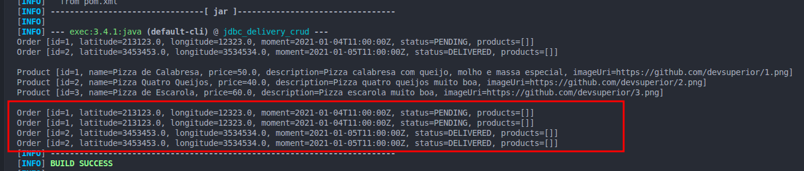
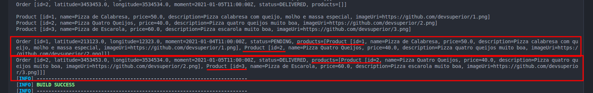

***Um Aviso Importante***

> O Código apresentado aqui está longe de ser perfeito. Meu foco será exclusivamente na prática de recurso realizando um sobrevoo na estrutura de projeto que  o Java oferece para acesso a dados de forma "crua" e nativa o JDBC, que é o tema central deste nanoprojeto. Então, caro programador experiente que está lendo isso, peço que não se preocupe demais com outras questões como arquitetura ou boas práticas. foco no essencial!

# Perguntas que busco responder com este nanoprojeto:

## O que preciso fazer manualmente quando acesso um banco relacional diretamente através do JDBC?

## Quando uma operação envolve várias instruções SQL, eu preciso controlar explicitamente a transação?

---

## Criar, configurar e iniciar o projeto (1)

### Setup base

- [X] criar projeto [1]

```Shell
mvn archetype:generate \
  -DgroupId=com.seunome.delivery \
  -DartifactId=jdbc-delivery-crud \
  -DarchetypeArtifactId=maven-archetype-quickstart \
  -DarchetypeVersion=1.5 \
  -DinteractiveMode=false
```

* [X] configurando aplicação para conexão com postgres[2]

usei a dependência:

```XML
<dependency>
    <groupId>org.postgresql</groupId>
    <artifactId>postgresql</artifactId>
    <version>42.7.4</version>
</dependency>
```

- não consegui criar o banco pelo dbeaver, então usei linha de comando para criação do banco.
- posteriormente alterei o código para ter um factory de conexão com o banco(a ideia é prover uma conexão via singleton) e a aplicação se conectou [3]
- estou usando dados da.env para conexão e não .properties

Comandos utilizados:

```Shell
#criar banco de dados
psql -U postgres -c "CREATE DATABASE delivery"

#listar todos os bancos de dados criados
psql -U postgres -l

#para ver as tabelas criadas no banco
psql -U postgres -d delivery -c "\dt"
#ou
psql -U postgres -d delivery -c "\dt *.*"
```

* [X] Criar entidades que serão usadas na prática do projeto [4]
* [X] realizar consulta de entidades individualmente  realizar parsing para objeto

## Operações a serem realizadas:

### Consulta

* [X] findAll Product
* [X] findAll Order
* [X] findById Product
* [X] findById Order
* [X] Order + products

### Inserção

* [ ] Product
* [ ] Order
* [ ] Order + Products

### Atualização

* [ ] Product
* [ ] Order

### Deleção

* [ ] Product
* [ ] Order
* [ ] Relacionamento Order/Product

---

### Realizando buscas de uma entidade e parsing para o objeto.

- observa-se a necessidade de parsing manual, um atributo por vez, porém o que pode ocorrer é a necessidade de tratamento de valor nulo assim como combinação entre atributos buscados na consulta(projeção) e mapeamento para montagem do objeto.
- além disso é preciso ter atenção aos tipos de dados que são retornados pelo resultSet e como serão feitos parsing para os tipos dos objetos.

* [X] realizar consulta com junção de entidades e realizar parsing

### Realizando buscas de entidades por junção

```SQL
SELECT * FROM tb_order
INNER JOIN tb_order_product ON tb_order.id = tb_order_product.order_id
INNER JOIN tb_product ON tb_product.id = tb_order_product.product_id
```



- como pode-se observar acima o retorno da query de junção provoca repetição de registros, isso se deu devido ao nome "id" ser igual para as tabels que estão sendo unidas, para tratar isso pode-se especificar melhor qual id está sendo consultado/utilizado para montar o objeto
- o ponto acima é importante pois a relação passa por uma tabela intermediária que representa e trata a relação N:N entre Product e Order.
- para evitar tratar no mapeamento diretamente onde fiz isolado em cada entidade, preferi especificar quais campos serão retornados na consulta e mapear em um retorno personalizado, o resultado a abaixo mostra que funciona corretamente agora.



- cada ordem possuia 2 produtos no moento da consulta, foram retornados 2 registros compostos por dois produtos cada.

### Implelentei um Menu

implementei um menu para facilitar o uso e testes para ver o resultado limpo e rápido no terminal enquanto o projeto crescer e foco no que importa, que é o jdbc.

aproveitei pra separar em alguns pacotinhos inspirados em mvc.

- Observei duas possibilidades de passar params para query quando fiz findByid como params posicionais, jdbc puro não tem opção de params nomeados, porém Hibernate e NamedParameterJdbcTemplate do Spring permitem. [7]
- o PreparedStatatement transforma a query em string para query de fato e resolve os params.
  - também evita sql injection dado que ele nativamente trata os poarams como dados e não como parte da query string.
  - faz tratamento e escaping de tipos
  - Planeja e otimiza a consulta melhorando seu plano de execução ao compilá-la.


também usei um optional só pra diferenciar a busca entre Product e Order e ter um exemplo simples guarado [8]


Operações implementadas

- FIndAll
- Order + products
- FIndById

---

---

### Resumo

- uma implementação que fiz no experimento foi de colocar as consultas e transformações em uma camada Dao com as implementações isoladas  e só chamá-las no App.
- Este repositório permanecerá salvo no github para possíveis novas implementações e novos experimentos ligados a jdbc.

Pesquisando observei diversos pontos que levaram o ecossitema a naturalmente criar o Hibernate como:

- aumento de produtividade por prover boilerplate
- gestão de transações integrado.
- redução de uso de try-catch
- uso de HQL, uma forma mais próxima dos objetos do que do banco relacional para escrita de querys

há ainda outros pontos relevantes que me levam a criar um nanoprojeto para explorar mais a configuração e uso do hibernate em breve.

---

## Pesquisas

[1] [maven-apache-org.translate.goog/guides/getting-started/maven-in-five-minutes.html?_x_tr_sl=en&amp;_x_tr_tl=pt&amp;_x_tr_hl=pt&amp;_x_tr_pto=tc](https://maven-apache-org.translate.goog/guides/getting-started/maven-in-five-minutes.html?_x_tr_sl=en&_x_tr_tl=pt&_x_tr_hl=pt&_x_tr_pto=tc)

[1.1]  [www.devmedia.com.br/introducao-ao-maven/25128](https://www.devmedia.com.br/introducao-ao-maven/25128)

[2] [www.instaclustr.com/support/documentation/postgresql/using-postgresql/connect-to-postgresql-with-java](https://www.instaclustr.com/support/documentation/postgresql/using-postgresql/connect-to-postgresql-with-java/)

[2.1] [learn.microsoft.com/pt-br/azure/postgresql/connectivity/connect-java?tabs=passwordless](https://learn.microsoft.com/pt-br/azure/postgresql/connectivity/connect-java?tabs=passwordless)

[2.2] [neon-com.translate.goog/postgresql/jdbc/connecting-to-postgresql-database?_x_tr_sl=en&amp;_x_tr_tl=pt&amp;_x_tr_hl=pt&amp;_x_tr_pto=tc&amp;_x_tr_hist=true](https://neon-com.translate.goog/postgresql/jdbc/connecting-to-postgresql-database?_x_tr_sl=en&_x_tr_tl=pt&_x_tr_hl=pt&_x_tr_pto=tc&_x_tr_hist=true)

[3] [www.devmedia.com.br/aprendendo-java-com-jdbc/29116](https://www.devmedia.com.br/aprendendo-java-com-jdbc/29116)

[3.1] [www.geeksforgeeks.org/java/establishing-jdbc-connection-in-java](https://www.geeksforgeeks.org/java/establishing-jdbc-connection-in-java/)

[3.2] [www.guj.com.br/t/connectionfactory-jdbc-boas-ideias-para-melhorar-a-classe/294712](https://www.guj.com.br/t/connectionfactory-jdbc-boas-ideias-para-melhorar-a-classe/294712/)

[3.3] [cursos.alura.com.br/forum/topico-connectionfactory-como-singleton-124574](https://cursos.alura.com.br/forum/topico-connectionfactory-como-singleton-124574)

[4] [github.com/devsuperior/jdbc-postgres](https://github.com/devsuperior/jdbc-postgres)

[5][www.geeksforgeeks.org/java/jdbc-result-set](https://www.geeksforgeeks.org/java/jdbc-result-set/)

[6][medium.com/javarevisited/why-hibernate-is-better-than-jdbc-key-advantages-and-examples-201b75fb5687](https://medium.com/javarevisited/why-hibernate-is-better-than-jdbc-key-advantages-and-examples-201b75fb5687)

[6.1][cybernite.in/blog/advantages-of-hibernate-over-jdbc](https://cybernite.in/blog/advantages-of-hibernate-over-jdbc/)

[7] [docs.oracle.com/javase/tutorial/jdbc/basics/prepared.html](https://docs.oracle.com/javase/tutorial/jdbc/basics/prepared.html)

[7.1] [pt.stackoverflow.com/questions/99620/qual-a-diferen%C3%A7a-entre-o-statement-e-o-preparedstatement](https://pt.stackoverflow.com/questions/99620/qual-a-diferen%C3%A7a-entre-o-statement-e-o-preparedstatement)

[8] [pt.stackoverflow.com/questions/447672/para-que-serve-o-optional-do-java-8-como-usar](https://pt.stackoverflow.com/questions/447672/para-que-serve-o-optional-do-java-8-como-usar)
